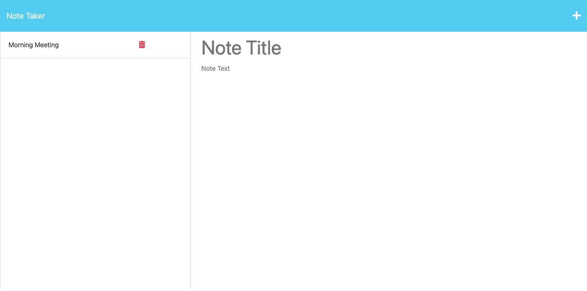

# Note Taker Application

## Description

Users can use this application to enter their notes (including a title and text for each note) as well as save this information. Saved notes are stored and displayed on the page and can be deleted by the user.

Get, post, and delete routes were added as part of the application. The codebase for this application can be accessed via the links below. The use of Express.js, Node.js, and the starter code / framework (provided by edX Boot Camps LLC) can be observed from there. 

## Links and Usage 

Deployed to Heroku - the link to the deployed application: https://murmuring-stream-12864.herokuapp.com/

The link to the repository: https://github.com/jamscc/app-note-taker

## Screenshot

## License

The license for the application: MIT License

badge (https://shields.io/)